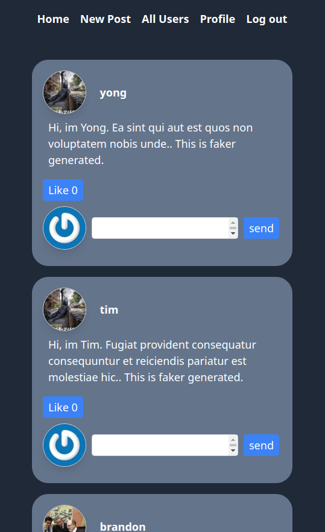

<!-- GETTING STARTED -->
## About Rails Final Project / Mini-Social-Media

This is a clone of social media website. This is part of project along [TheOdinProject course](https://www.theodinproject.com/lessons/ruby-on-rails-rails-final-project)

<!-- Todo -->

Live DEMO : 
- Full Stack Ruby on Rails : 

Current feature:
- basic Create & Read of Posts
- basic Create & Read of Comments
- photo upload as post / avatar
- User Auth with Github
- user-following
- post-liking

Gem used:
- devise
- faker
- omniauth
- tailwindcss
- more, refer to gem file

Test:
- un-tested

Repo:
- https://github.com/WongYC-66/odin-rails-final-project

### Prerequisite:
1. Have postgreSQL, Ruby, Rails installed
1. Register an Outh app at Github, and get CLIENT_ID and CLIENT_SECRET from https://github.com/settings/developers

### Installation 
1. Clone the repo
1. cd odin-rails-final-project
1. bundle install
1. Create .env file like .env-sample
1. rails db:migrate:reset
1. rails db:seed
1. rails tailwindcss:install
1. ./bin/dev
1. visit at http://localhost:3000

## Todo:
- add mailer by adding mailing service API

